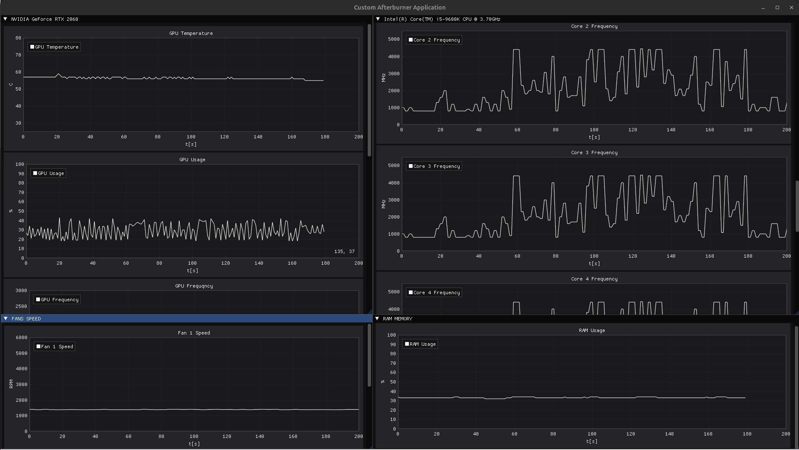
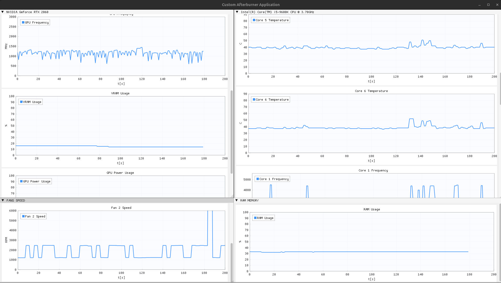

Screenshots of some demo console/application visualization. Only two fans are visible because my other fans does not work or something is wrong with my msi chips. Can't figure it out. 

  
  
  
  

<h2>
First application visualization with per CPU core temperatures/frequencies & per FAN speed in RPM.
</h2>

<h2>CPU</h2>
<ul>
    <li>
Whole CPU Utilization
</li>
    <li>
Temperature of each CPU Core
</li>
    <li>
Frequency of each CPU Core
</li>
</ul>

<h2>GPU</h2>
<ul>
    <li>
GPU Temperature
</li>
    <li>
GPU Usage
</li>
    <li>
GPU Frequency
</li>
    <li>
GPU VRAM Usage
</li>
    <li>
GPU Power Usage
</li>
</ul>

<h2>RAM</h2>
<ul>
    <li>
RAM Memory Usage (maybe will play with more parameters)
</li>
</ul>

<h2>FANS</h2>
<ul>
    <li>
Available Fans Speed in RPM
</li>
</ul>

    
    

