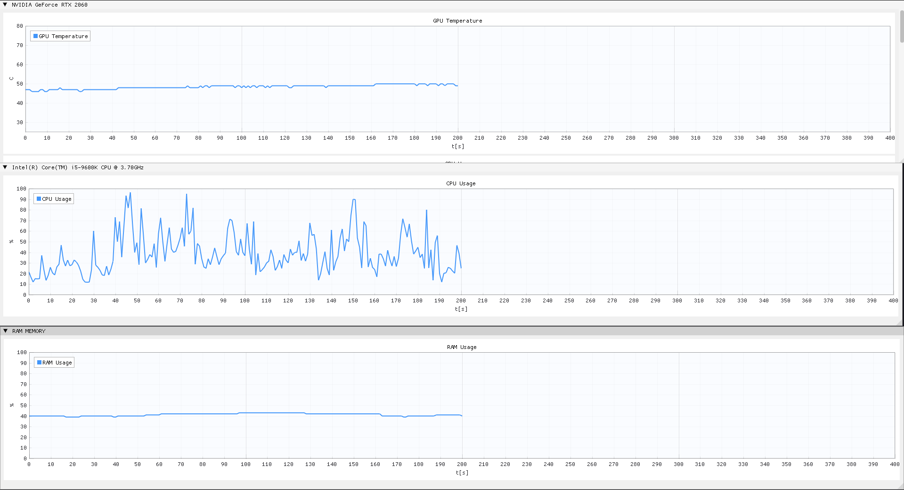
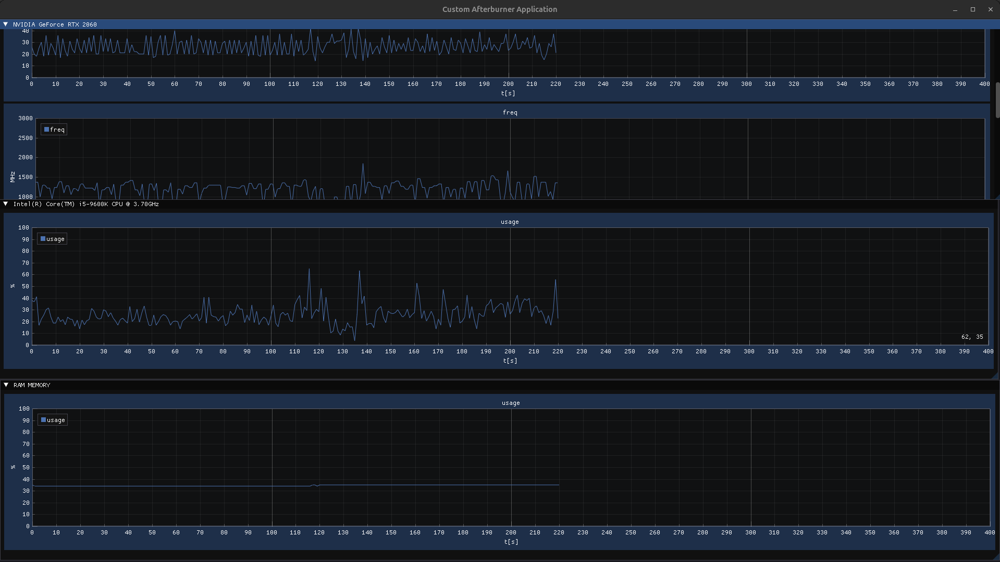
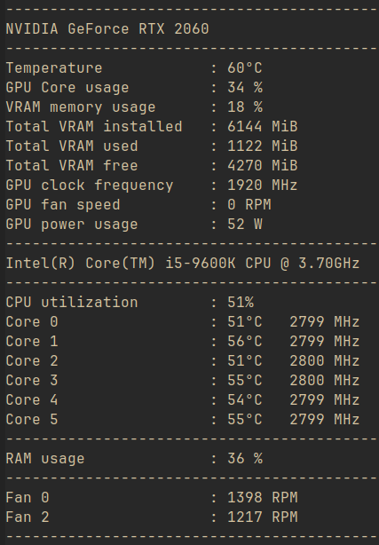

Screenshots of some demo console/application visualization. Only two fans are visible because my other fans does not work or something is wrong with my msi chips. Can't figure it out. 

  
  
  
  

